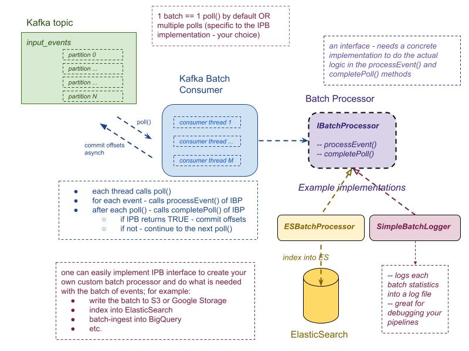
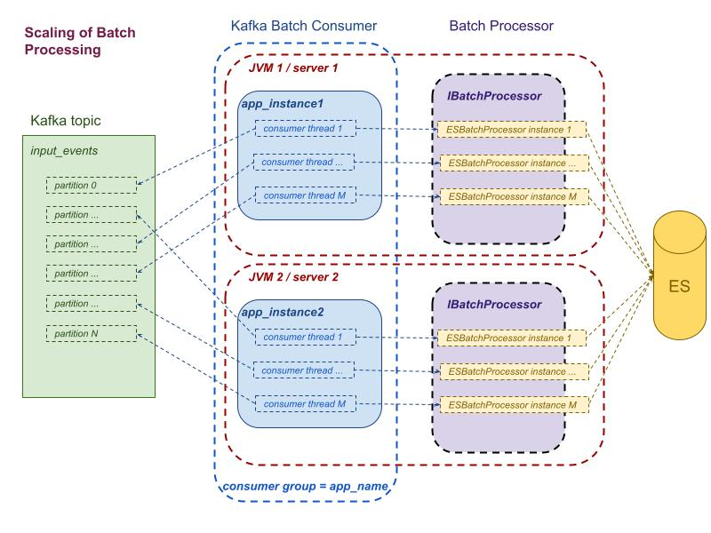

TODO add Build and Download info

# Welcome to the kafka-batch-processor wiki!

# Introduction

Kafka Batch Processor reads batches of messages from Kafka and processes them as specified in the selected IBatchProcessor implementation

Provided example implementations of the IBatchProcessor are: 

** ElasticSearchBatchProcessor - indexes batches into ElasticSearch - in the https://github.com/BigDataDevs/kafka-elasticsearch-consumer project

** SimpleLoggerProcessor - logs info about processed batches into log files (great for debugging your pipelines)

It is a simple Spring-based Java library - that can be easily included as a JAR dependency to your own project - and used to process events from Kafka in batches.

You can easily customize how to handle:

** logical boundaries of the "batches" of events

** recoverable vs, non-recoverable exceptions while processing events and batches

** when and under what conditions to commit or not commit offsets of "processed" batches

** retry behavior in cases of failures

** starting offsets positions per partition

## Architecture of the kafka-batch-processor

** One batch of messages is composed of all messages retrieved during one poll() call to Kafka
OR it can comprised of multiple poll() messages if implemented this way in a custom IBatchProcessor implementation.

** in order to use the project - one must choose which IBatchProcessor to use:

** ** you can start with one of the provided example implementation: ESBatchProcessor or SimpleLoggerProcessor - and customize them as needed

** ** you can implement your own one: for that, you have to implement the IBatchProcessor interface and ts two main methods:

** ** ** processEvent(...) - specify how to parse/transform an individual event - and add to the outgoing batch (see provided examples for ideas)

** ** ** completePoll(...) - specify what to do with the batch of collected messages from the poll() - and whether the poll is considered "done" and offsets can be committed to Kafka

Kafka Batch Processor is highly scalable. To scale horizontally - you need to start additional instances of your application and they will form the same consumer group and share the load of event processing:

**Main features:**

* starting offset positions can be specified via configuration properties
* IConsumerWorker interface-based consumers allow you to :

** customize how offsets are exposed to other systems - like JMX/monitoring or external storage

** customize when offsets are committed to Kafka - allowing you to specify your own logic/rules for re-processing of potentially failed events/batchs

* IBatchMessageProcessor interface-based batch processors can be customized to process each batch of messages into any destination

# How to use ? 

TODO

# Versions

* Kafka Version: 2.1.x

* ElasticSearch: 6.2.x

* JDK 1.8, 1.11+ 

# Configuration

Application properties are specified via the kafka-batch-processor.properties file - you have to adjust properties for your env:
TODO add link

You can specify you own properties file via `-Dprocessor.properties=/abs-path/your-kafka-processor.properties`

Logging properties are specified in the logback.xml file - you have to adjust properties for your env:
[logback.xml](src/main/resources/config/logback.xml).
You can specify your own logback config file via `-Dlogback.configurationFile=/abs-path/your-logback.xml` property

Application Spring configuration is specified in the kafka-batch-context-public.xml

Consumer start options can be specified with system property `consumer.start.option`. The value of this property can be `RESTART`, `EARLIEST`, `LATEST`  which applied for all partitions or `CUSTOM` which requires additional property `consumer.custom.start.options.file`. 
The value of `consumer.custom.start.options.file` property is an absolute path to the custom start offsets configuration file. 
(see [kafka-batch-custom-start-options.properties](src/main/resources/config/kafka-batch-custom-start-options.properties)).
TODO fix links
By default `RESTART` option is used for all partitions.

Examples:
- `-Dconsumer.start.option=RESTART`
- `-Dconsumer.start.option=LATEST`
- `-Dconsumer.start.option=EARLIEST`
- `-Dconsumer.start.option=CUSTOM -Dconsumer.custom.start.options.file=/abs-path/your-kafka-es-indexer-custom-start-options.properties`

# Customization
TODO

# Running as a Docker Container

TODO

# License

kafka-batch-processor

	Licensed under the Apache License, Version 2.0 (the "License"); you may
	not use this file except in compliance with the License. You may obtain
	a copy of the License at

	     http://www.apache.org/licenses/LICENSE-2.0

	Unless required by applicable law or agreed to in writing,
	software distributed under the License is distributed on an
	"AS IS" BASIS, WITHOUT WARRANTIES OR CONDITIONS OF ANY
	KIND, either express or implied.  See the License for the
	specific language governing permissions and limitations
	under the License.

# Contributors
 - [Marina Popova](https://github.com/ppine7)
 - [Dhyan Muralidharan](https://github.com/dhyan-yottaa)
 - [Andriy Pyshchyk](https://github.com/apysh)
 - [Vitalii Chernyak](https://github.com/merlin-zaraza)

# Acknowledgments 
- [Krishna Raj](https://github.com/reachkrishnaraj) - creator of the original https://github.com/reachkrishnaraj/kafka-elasticsearch-standalone-consumer project that served as a foundation and inspiration for our further work!